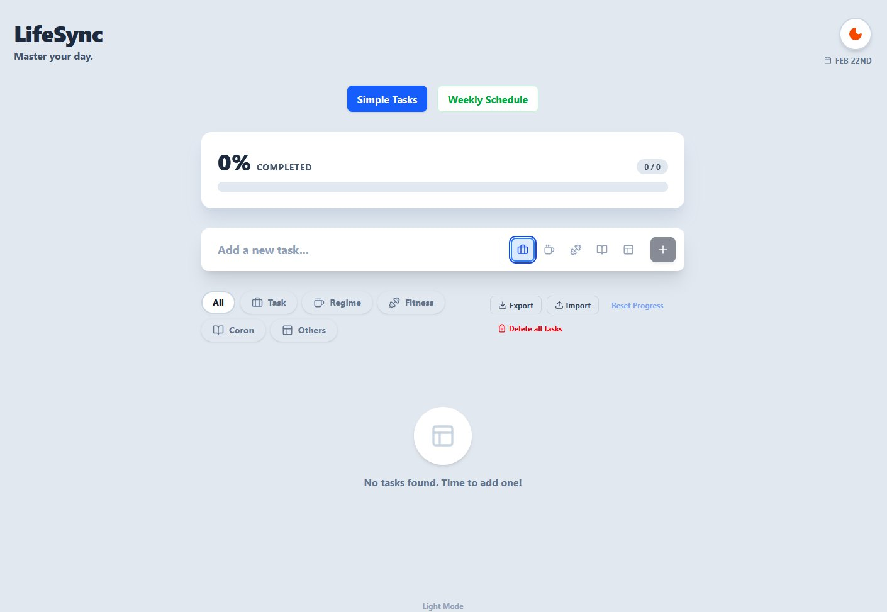
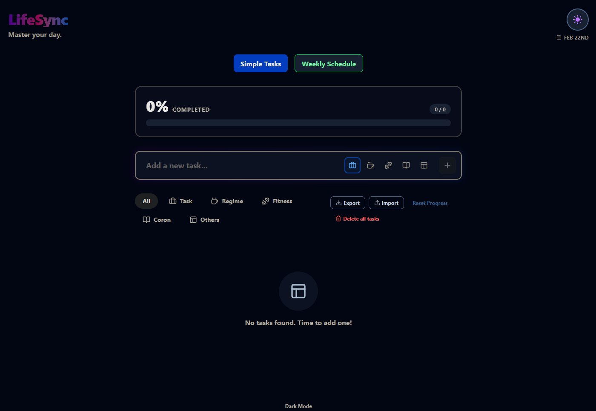
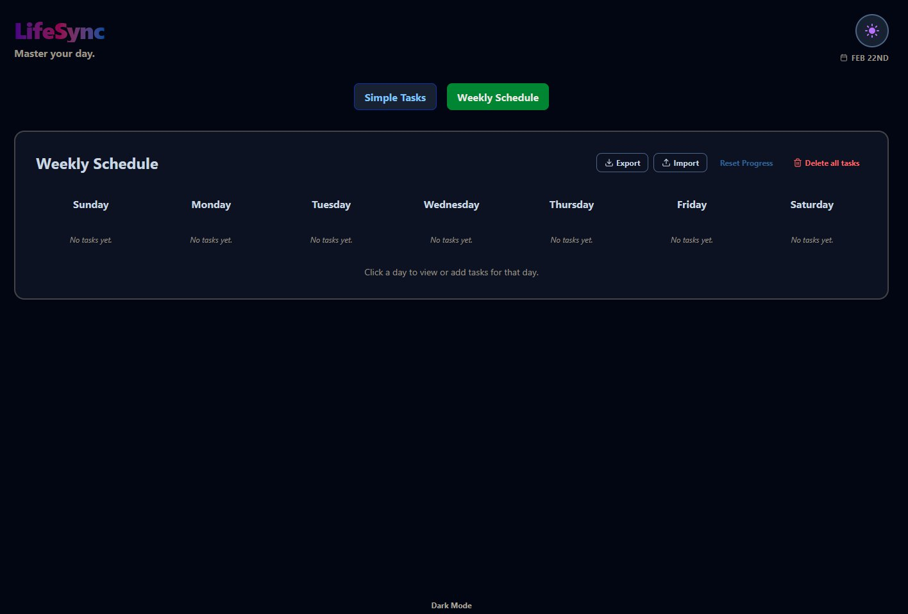
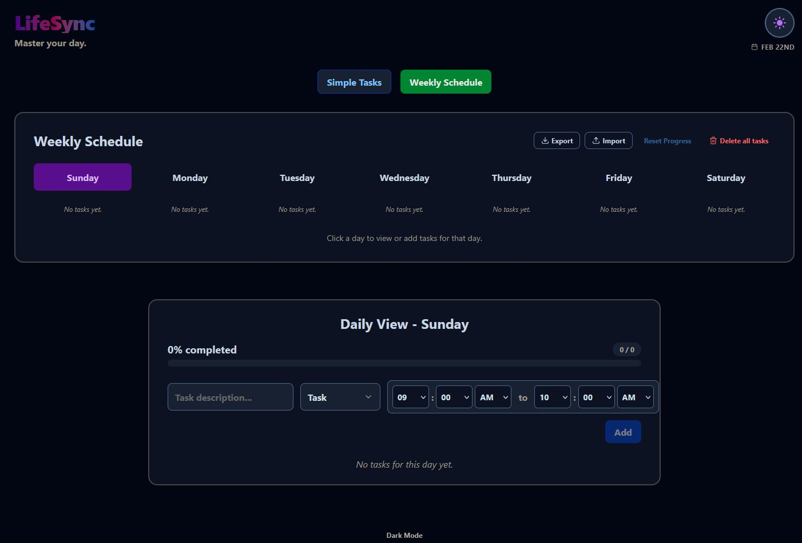

# LifeSync PWA

LifeSync is an installable Progressive Web App for planning daily tasks and weekly schedules with clean light/dark themes, offline support, and local-first data storage.

Live site: https://life-sync-pwa.pages.dev/


## Screenshots

<table>
  <tr>
    <td></td>
    <td></td>
  </tr>
  <tr>
    <td></td>
    <td></td>
  </tr>
</table>


## Features

### Simple Tasks
- Quick task capture and completion tracking
- Global progress tracking
- Task filtering by category (horizontally scrollable chip bar)
- Delete controls for completed tasks or all tasks
- Reset progress for unfinished planning cycles

### Weekly Schedule
- Per-day planning with time range, category, and edit/delete actions
- Daily View editor with progress tracking per day
- Multiple weekly profiles (e.g. Work Week, Exam Week, Ramadan, Gym Cut)
  - Create, rename, duplicate, and delete profiles
  - Instant profile switching — selected day preserved on switch
  - Weekly tasks and bulk operations scoped to active profile
  - Replacing or deleting a profile never affects Simple Tasks
  - Up to 10 profiles, 50 tasks per profile

### Category System
- Built-in categories: `Task`, `Regime`, `Fitness`, `Others`
- Custom categories: create, rename, and delete your own
  - Assign a color (curated palette) and icon (emoji) per category
  - Built-ins are protected from editing or deletion
  - Deleting a custom category requires reassigning its tasks first
  - Up to 15 categories total

### Import / Export
- Export current profile only or full data backup
- Four import modes:
  - **Merge into current profile** — adds imported tasks alongside existing ones
  - **Replace current profile** — replaces weekly tasks of active profile only
  - **Create new profile from import** — creates a new profile from imported data
  - **Replace everything** — full data restore from backup
- Blocking impact preview required before any import is applied
- Deterministic profile naming on import:
  - uses profile name from payload when available
  - falls back to `Imported Profile (YYYY-MM-DD HH:mm)` with collision-safe suffixing
- Category conflict resolution on import (ID-first, then name-match, then fallback)
- Zero-task imports are valid and handled explicitly per mode
- Selection state fully recovered after every import
- Legacy data formats (v1/v2/v3) automatically migrated on load and on import

### Data Safety
- All destructive actions require in-app confirmation modals (no browser dialogs)
- Replacing a profile never affects Simple Tasks — only that profile's weekly tasks are modified
- Storage size warning before approaching localStorage limit
- Hard cap with clear error message if quota is exceeded
- Corrupt or malformed data repaired automatically on load

### General
- Theme toggle (Light / Dark)
- PWA install support (desktop + mobile)
- Offline-ready behavior via Service Worker
- Local-first persistence using browser `localStorage` (no backend required)

---

## Tech Stack

- React 19 + TypeScript
- Vite 7
- Tailwind CSS 4
- date-fns
- Lucide React icons

## Run Locally

```bash
npm install
npm run dev
```

Open the local URL shown by Vite (usually `http://localhost:5173`).

## Data Storage

- All data is saved in browser `localStorage` — no backend required.
- Data is scoped per browser/device.
- Storage payload is versioned (currently v3) with automatic migration from all older formats.
- Use Export/Import to move or back up your data across devices.
